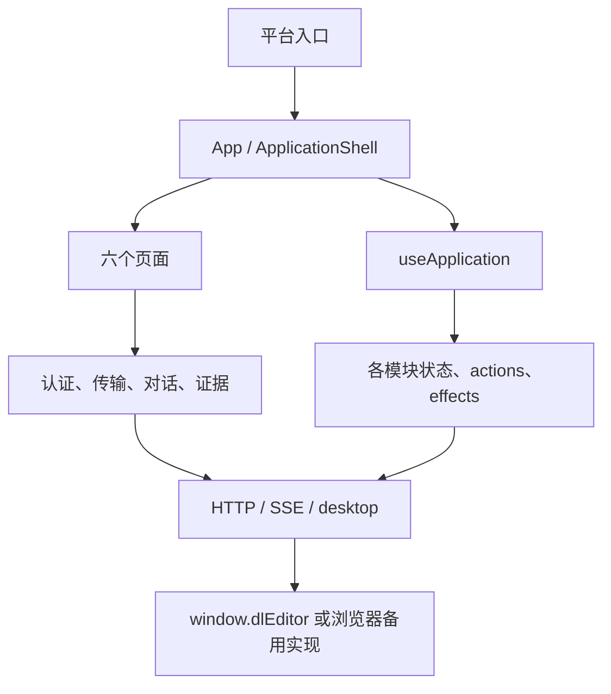

# 前端架构

## 目录与入口

```text
Windows/                         Windows 包、主进程与打包配置
Mac/                             Mac 包、主进程与打包配置
shared/
  build/vite.config.cjs          两端共用的 Vite 配置工厂
  renderer/
    app/                         应用组装、导航、Context 和跨功能协调
    pages/{editor,cloud,delphi,guess,engine,research}/
    features/{auth,transfers,conversation,evidence}/
    components/                  Metric、DurationValue 等公用 UI
    hooks/                       通用 React hooks
    services/                    HTTP、SSE、桌面桥接、签名 URL 缓存
    utils/                       无界面依赖的纯函数
    styles/                      主题、布局、控件、弹窗等全局样式
  testing/                       两端共用的源码、构建和运行回归检查
```

两端 `src/renderer/main.jsx` 继续加载本端 `App.jsx` 和 `styles.css`。`App.jsx` 转发至共用应用，CSS 入口按固定顺序导入页面与公用样式。

`shared/renderer/package.json` 只声明源码使用 ES module，不引入独立依赖安装。React、React DOM、Lucide 和平台资产通过 Vite 从正在构建的平台包解析。

| 别名 | 实际来源 |
| --- | --- |
| `@platform/package` | 当前平台的 `package.json`，包括版本信息 |
| `@platform/icon` | 当前平台的 `build/icon.svg` |
| `react`、`react-dom`、`lucide-react` | 当前平台的 `node_modules` |

## 依赖方向

页面负责业务 UI，跨页面能力放入 `features/`。基础服务、公用工具与公用 UI 不导入页面；页面之间也不直接导入。跨页面协调由 `app/` 完成。



页面入口允许读取 `ApplicationContext`。该 Context 本身不导入业务控制器，因此不会形成循环依赖。

## 状态与生命周期

`app/useApplication.js` 在应用根部调用所有状态 hooks，组合派生数据、操作函数，再注册 effects。Context 向页面提供当前渲染周期的模型。

| 所属模块 | 持续挂载的状态 | 操作与副作用 |
| --- | --- | --- |
| app | 导航、主题、窗口、提示、启动屏、软件信息 | 窗口事件、主题、任务时钟、更新检查 |
| auth | 登录状态、表单、验证码倒计时、认证 ref | 登录请求、token 刷新、过期处理 |
| editor | 压制任务、设置、硬件状态、起始时间编辑 | 添加、开始、暂停、恢复、取消 |
| transfers | 自动化选项、上传状态、持久化队列、运行锁与 ref | 自动入队、串行执行、暂停、恢复、取消、清理 |
| cloud | 当前仓库、日期、筛选、分页结果 | 按活动页面加载、删除归档 |
| guess | 猜测、关联记忆、注册表、选中项、请求序号 | 加载、反馈、防止过期请求覆盖 |
| research | 权限、当前子页、筛选、数据、选中项、导出状态 | 权限检查、分页、导出 |
| engine | 解锁状态与输入 | 解锁、锁定 |

以上状态不会因为 `PageContent` 切换页面而卸载。Editor 的桌面订阅、自动入队和传输执行也持续有效。Cloud、Guess、Research 的加载 effects 保留原有活动页面条件和依赖数组。

`ConversationWorkspace`、`EngineWorkspace` 等组件原先在组件内部的状态仍保留在组件内；它们原有的卸载和重新初始化行为没有提升为全局状态。

## 操作函数与跨功能协调

`*.actions.js` 导出 `create...Actions(dependencies)`，明确解构所需状态、setter 和协作回调。这些工厂在每次渲染时创建与原 App 内函数相同的闭包，不包含 hooks。

`useApplication` 在同一渲染内完成全部工厂组装。少量跨工厂调用通过转发回调连接，调用时所有操作都已组装完成。工厂本身不能在组装过程中执行任务或调用这些回调。

登录完成后刷新 Cloud/Research、退出时重置跨页面状态，由 `app/session.actions.js` 负责。认证模块不直接依赖页面实现。

## 样式约束

CSS 按领域拆分，但由两端 `styles.css` 统一按原顺序导入；页面组件不各自追加这些 CSS。不要随意调整导入顺序。

两端目前有差异的标题栏样式和 Engine 结果样式保留在各自的 `platform-styles/`。其中 Engine 差异是已有版本差异，本次没有擅自统一外观。其他 25 个样式分区共用。

新增样式应使用所属页面或组件的类名前缀。跨页面选择器和全局主题变量放在 `styles/` 中。
